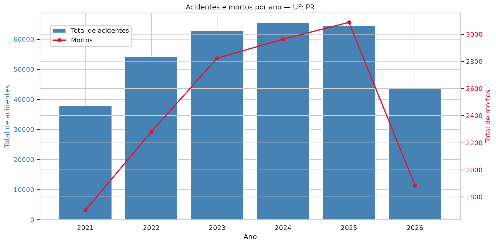
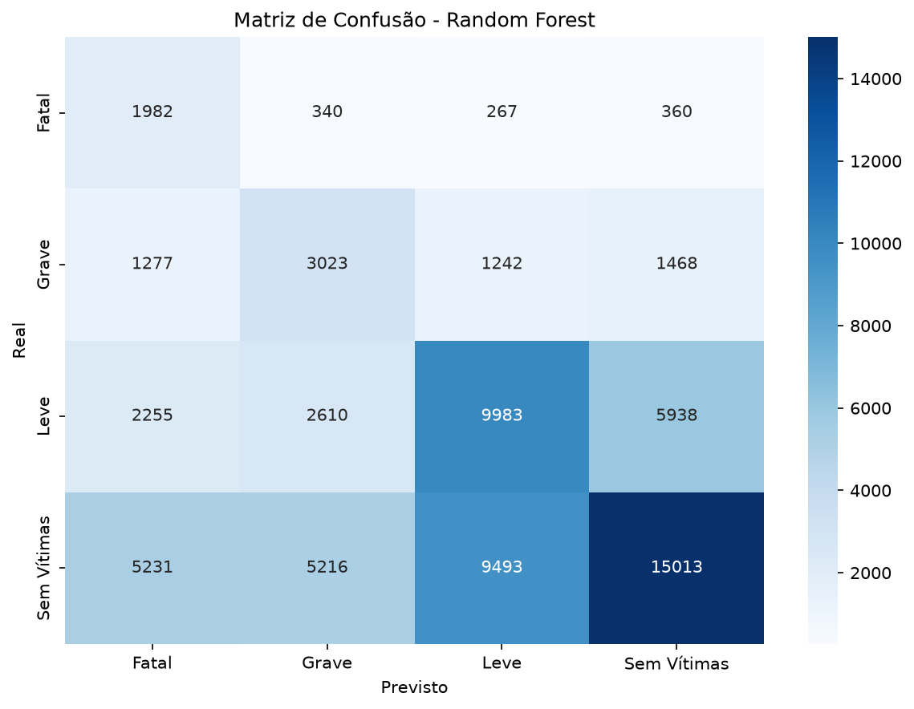

# Análise de Acidentes nas Rodovias Federais do Paraná

Pipeline completo de Ciência de Dados aplicado aos dados abertos de acidentes da **Polícia Rodoviária Federal (PRF)**, com análise exploratória, dashboard interativo e modelo de Machine Learning para previsão de gravidade.

---

## Visão Geral

- **Fonte dos dados:** [PRF — Dados Abertos](https://www.gov.br/prf/pt-br/acesso-a-informacao/dados-abertos/dados-abertos-da-prf)
- **Período analisado:** 2021 a 2026
- **Recorte geográfico:** Paraná (PR)
- **Total de registros:** 328.486 acidentes
- **Total de mortos:** 14.745
- **Taxa de fatalidade:** 4,49%

---

## Arquitetura do Projeto

```
dados_prf/
│
├── dados_brutos/              # CSVs originais da PRF (não versionados)
├── dados_tratados/            # Dados limpos e resultados (não versionados)
├── imagens/                   # Gráficos gerados (versionados)
├── modelo/                    # Modelo ML treinado (não versionado — gerado pelo script 06)
│
├── 01_extracao.py             # Leitura e consolidação dos CSVs brutos
├── 02_limpeza.py              # Limpeza e padronização dos dados
├── 03_analise.py              # Análises estatísticas descritivas
├── 04_visualizacao.py         # Geração dos 8 gráficos estáticos
├── 05_dashboard.py            # Dashboard interativo (Streamlit)
├── 06_machine_learning.py     # Treinamento do modelo Random Forest
│
├── requirements.txt           # Dependências do projeto
├── .gitignore
├── LICENSE
└── README.md
```

---

## Tecnologias Utilizadas

| Categoria | Tecnologias |
| :--- | :--- |
| **Linguagem** | Python 3.14 |
| **Manipulação de dados** | Pandas, NumPy |
| **Visualização** | Matplotlib, Seaborn, Plotly |
| **Dashboard** | Streamlit |
| **Machine Learning** | Scikit-learn (Random Forest) |
| **Versionamento** | Git, GitHub |

---

## Como Executar

### 1. Clone o repositório

```bash
git clone https://github.com/beaverbit/dados_prf.git
cd dados_prf
```

### 2. Crie as pastas necessárias

O Git não versiona as pastas que estão no `.gitignore`. Crie-as manualmente:

```bash
mkdir -p dados_brutos dados_tratados modelo
```

### 3. Crie o ambiente virtual

```bash
python3 -m venv venv
source venv/bin/activate  # Linux/Mac
# ou
venv\Scripts\activate     # Windows
```

### 4. Instale as dependências

```bash
pip install --upgrade pip
pip install -r requirements.txt
```

### 5. Baixe os dados brutos

Acesse [Dados Abertos da PRF](https://www.gov.br/prf/pt-br/acesso-a-informacao/dados-abertos/dados-abertos-da-prf) e baixe os arquivos de **Acidentes** dos anos 2021 a 2026. Salve todos em `dados_brutos/`.

> ⚠️ **Nota:** o modelo treinado (`modelo/modelo_rf.pkl`) **não está versionado** por exceder o limite de 100 MB do GitHub. Ele será gerado automaticamente no passo 6.

### 6. Execute o pipeline na ordem

```bash
python3 01_extracao.py         # Consolida os CSVs brutos
python3 02_limpeza.py          # Limpa e padroniza
python3 03_analise.py          # Gera as análises
python3 04_visualizacao.py     # Gera os 8 gráficos
python3 06_machine_learning.py # Treina o modelo (gera modelo/*.pkl)
streamlit run 05_dashboard.py  # Abre o dashboard
```

Acesse `http://localhost:8501` no navegador para ver o dashboard.

---

## Principais Resultados

### Análise Exploratória

- **Madrugada é o horário mais letal:** às 3h da manhã, a taxa de fatalidade é **10,77%** — mais que o dobro da média geral.
- **Fim de semana concentra acidentes graves:** domingo (5,02%) e sábado (4,73%) têm as maiores taxas de fatalidade.
- **Pista simples é 2x mais letal que pista dupla:** 6,06% vs 3,45%.
- **Transitar na contramão é a causa mais letal:** taxa de fatalidade de 11,50%.
- **Atropelamento de pedestre é o tipo mais letal:** 14,43% de fatalidade.

### Machine Learning (Random Forest)

- **Acurácia global:** 45,67%
- **F1-Score (weighted):** 0,4764
- **Recall para classe "Fatal":** 67% (o modelo identifica 2 em cada 3 acidentes fatais)
- **Top 5 features mais importantes:** traçado da via, hora, tipo de acidente, mês, dia da semana

### Validação com 3 Testes de Simulação

| Teste | Condições | Previsão | Prob. Fatal |
| :--- | :--- | :---: | :---: |
| 1 | 3h, domingo, pista simples, curva, contramão | Leve | 15,4% |
| 2 | 22h, sábado, pista simples, declive, chuva, velocidade | **Fatal** | **38,2%** |
| 3 | 14h, terça, pista dupla, reta, pleno dia | **Sem Vítimas** | **4,5%** |

O modelo demonstrou ser sensível aos fatores de risco conhecidos na literatura de segurança viária.

---

## Screenshots

### Dashboard Analítico



### Previsão com Machine Learning



---

## Referências

- BRASIL. Polícia Rodoviária Federal. **Dados Abertos da PRF**. Disponível em: https://www.gov.br/prf/pt-br/acesso-a-informacao/dados-abertos
- PEDREGOSA, F. et al. **Scikit-learn: Machine Learning in Python**. JMLR, 2011.
- MCKINNEY, W. **Python for Data Analysis**. O'Reilly Media, 2022.
